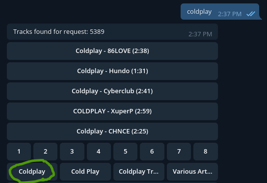
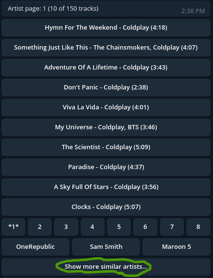

# YandexMusicBot

Telegram bot that allows you to search and download mp3 tracks from Yandex music.
This is for personal use only from your local network. Don't try to use it on a VDS/VPS.

### Make project by command with Java 8
```bash
mvn clean install
```

App will be created at `/target/YandexMusicBot-0.0.1-SNAPSHOT.jar`

###  Setup environment variables before start

```bash
export ALLOWED_USERS="telegramUserId1,telegramUserId2,..."
export BOT_NAME="your_bot_name_bot"
export BOT_TOKEN="your_bot_token"
export YANDEX_COOKIE="Session_id=your_session_id"
```

* **ALLOWED_USERS** - telegram users ID that allowed to use the bot.
* **BOT_NAME** - your bot name
* **BOT_TOKEN** - your bot token
* **YANDEX_COOKIE** - COOKIES for your yandex music account, check it in your browser, needed only Session_id. 

If _Session_id_ is incorrect you won't be able to download full mp3 files(only demo).

###  Run the project
```bash
java -jar YandexMusicBot-0.0.1-SNAPSHOT.jar
```

The application is successfully launched if you see `Started BotApplicationKt in 1.398 seconds (JVM running for 1.955)`

## Now you can send commands to telegram bot.

Send the text "coldplay" and you will get the first page with tracks, page numbering and artists.



Click on the button with the artist's name and you will see his tracks



Click on the similar button to see similar artists


When you click on a track, you will get mp3 file

