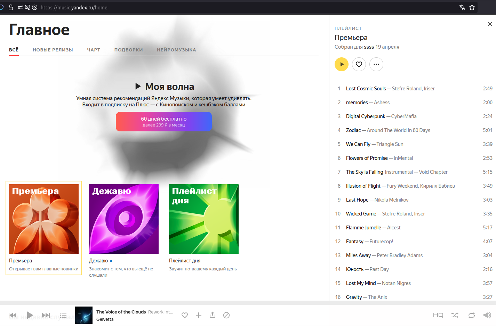
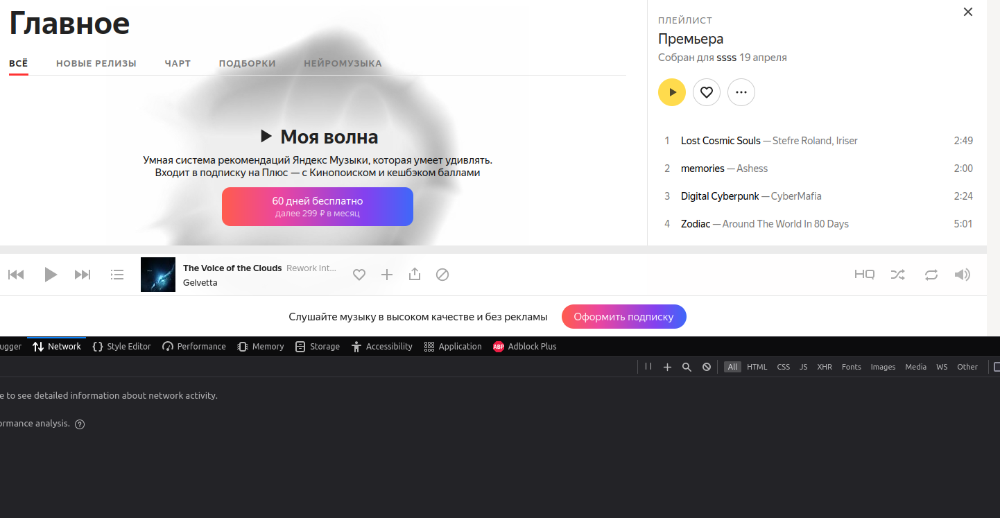
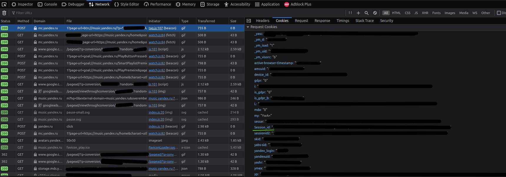

# Yandex Music Bot - Телеграм бот для яндекс музыки.

Telegram-бот, который позволяет вам искать и скачивать mp3-треки из Яндекс музыки.
Например, вы можете прослушивать яндекс музыку в браузере(ежедневный персональный плейлист), 
а с помощью бота скачать понравившиеся треки в кэш телеграм и слушать плейлист на любом устройстве, а так же обмениваться треками с друзьями.

_*Этот бот только для персонального использования в вашей сети провайдера. Не пытайтесь использовать VDS / VPS, т.к. будете часто получать капчу и не сможете ничего скачать._

### Команды бота:

1. Любой текст отправляемый боту выполняет поиск по яндекс музыке.
2. Отправив команду "/daily" можно получить свой персональный плейлист.
3. Отправив команду "/playlists" можно получить список персональных плейлистов.
4. Отправив команду "/login с параметрам" происходит обновление сессии яндекс музыки

### Соберите проект командой, используйте Java 8 и выше.

```bash
mvn clean install
```

Приложение будет скомпилировано в `/target/YandexMusicBot-0.0.2-SNAPSHOT.jar`

### Настройка переменных окружения перед запуском

В директории с jar приложением создайте файл **application.properties** со следующим содержимым:

```properties
allowed.users=telegramUserId1,telegramUserId2
bot.name=your_bot_name_bot
bot.token=your_bot_token
yandex.cookie=Session_id=your_session_id
```
Где,
* **allowed.users** - идентификаторы пользователей telegram, которым разрешено использовать бота.
* **bot.name** - имя вашего бота
* **bot.token** - токен вашего бота
* **yandex.cookie** - Файлы cookie для вашего аккаунта yandex music, найдите его с помощью браузера(нужен только Session_id)

Если _Session_id_ указан неверно, вы не сможете загрузить полные mp3-файлы (только демо-версию) и у вас не будет дневного плейлиста.

###  Поиск Session_id в браузере
Откройте страницу https://music.yandex.ru/home и перейдите в какой-либо плейлист.


Нажмите F12 что бы открыть консоль разработчика в браузере, перейдите на вкладку Network.



Кликните на любой музыкальный трэк на страничке, что бы увидеть запросы к серверу яндекс.

Кликая по запросам и открывая вкладку Cookies, среди них нужно найти куки по имени Session_id



###  Запустите приложение бота командой
```bash
java -jar YandexMusicBot-0.0.2-SNAPSHOT.jar
```

Приложение успешно запущено, если вы увидите: `Started BotApplicationKt in 1.398 seconds (JVM running for 1.955)`

## Теперь вы можете отправлять команды telegram-боту.

Отправьте текст "coldplay", и вы получите первую страницу с треками, нумерацией страниц и исполнителями.


Нажмите на кнопку с именем исполнителя, и вы увидите его треки


Нажмите на кнопку "Похожие", чтобы увидеть похожих исполнителей


Когда вы нажмете на трек, начнется скачивание mp3-файла ботом, через некоторое время он пришлет его вам.

